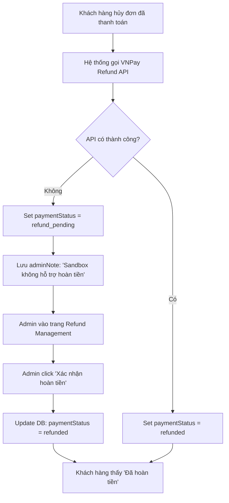
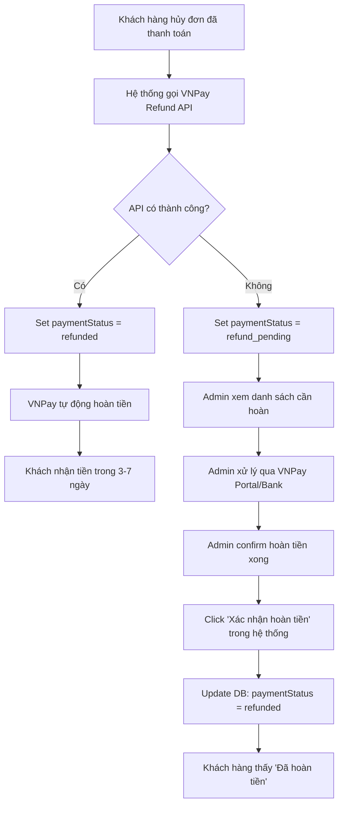

# 📋 Giải thích về Hoàn tiền VNPay và Sandbox

## ❓ Vấn đề bạn gặp phải

### 1. **Tại sao khi hủy đơn hàng, trạng thái thanh toán về `refund_pending` thay vì `refund_failed`?**

**Trước đây:**
- Khi hủy đơn hàng đã thanh toán qua VNPay, hệ thống cố gắng gọi API VNPay để hoàn tiền tự động
- Trong môi trường **VNPay Sandbox**, API hoàn tiền **KHÔNG được hỗ trợ thực tế**
- Khi API trả về lỗi hoặc RspCode != '00', code cũ sẽ set `paymentStatus = 'refund_failed'`
- Điều này gây hiểu nhầm vì:
  - Khách hàng thấy "Hoàn tiền thất bại" → lo lắng
  - Admin thấy "refund_failed" → nghĩ là có lỗi nghiêm trọng
  - Thực tế chỉ là VNPay Sandbox không hỗ trợ, cần xử lý thủ công

**Sau khi sửa:**
- Khi API VNPay không trả về thành công, hệ thống sẽ set `paymentStatus = 'refund_pending'` (Chờ xử lý thủ công)
- Thêm trường `adminNote` trong `refundInfo` để admin biết lý do
- UI hiển thị: "Chờ hoàn tiền thủ công" thay vì "Hoàn tiền thất bại"

### 2. **Tại sao xác nhận hoàn tiền thành công nhưng VNPay Sandbox không cập nhật?**

**Đây là hành vi ĐÚNG và BÌNH THƯỜNG:**

#### VNPay Sandbox là gì?
- **Môi trường test** - KHÔNG phải hệ thống thật
- Chỉ để test luồng thanh toán (tạo đơn, callback)
- **KHÔNG hỗ trợ hoàn tiền thực tế** - không có tài khoản thật, không có tiền thật

#### Khi bạn "Xác nhận hoàn tiền" trong Admin:
- Hệ thống **CẬP NHẬT DATABASE** của bạn:
  - `paymentStatus` → `refunded`
  - `refundInfo.status` → `success`
  - Lưu thời gian xử lý, ghi chú admin
- **KHÔNG GỬI REQUEST** tới VNPay API (vì là xử lý thủ công)
- Vì vậy VNPay Sandbox **không thay đổi gì**

#### Trong Production (Thực tế):
Khi dùng VNPay Production:
1. **Tự động (nếu API hoàn tiền hoạt động):**
   - Gọi VNPay Refund API
   - Nếu thành công → Auto set `refunded`
   - Tiền thực sự được hoàn vào tài khoản khách (3-7 ngày)

2. **Thủ công (nếu API fail hoặc admin muốn kiểm soát):**
   - Admin xem danh sách đơn cần hoàn tiền
   - Admin tự liên hệ VNPay/ngân hàng hoặc xử lý qua portal VNPay
   - Sau khi hoàn tiền xong, admin vào hệ thống đánh dấu "Đã hoàn tiền"
   - Hệ thống cập nhật trạng thái → Khách hàng thấy thông báo

---

## 🔧 Những thay đổi đã thực hiện

### 1. **Server - `orderController.js`**

#### Trước:
```javascript
} else {
    order.paymentStatus = 'refund_failed' // ❌ Gây hiểu nhầm
    refundInfo = {
        status: 'pending',
        method: 'manual',
        message: 'Yêu cầu hoàn tiền đang được xử lý...'
    }
}
```

#### Sau:
```javascript
} else {
    order.paymentStatus = 'refund_pending' // ✅ Rõ ràng hơn
    refundInfo = {
        status: 'pending',
        method: 'manual',
        message: 'Yêu cầu hoàn tiền đang được xử lý...',
        adminNote: 'VNPay API không phản hồi thành công (có thể do sandbox). Cần xử lý hoàn tiền thủ công.' // ✅ Thêm note cho admin
    }
}
```

#### Tương tự cho trường hợp catch exception:
```javascript
} catch (refundErr) {
    order.paymentStatus = 'refund_pending' // ✅ Thay vì refund_failed
    refundInfo = {
        status: 'pending',
        method: 'manual',
        adminNote: 'Lỗi khi gọi VNPay API. Cần xử lý hoàn tiền thủ công.' // ✅ Giải thích rõ ràng
    }
}
```

### 2. **Admin UI - `OrdersPage.jsx`**

#### Cập nhật text hiển thị:
```javascript
const texts = {
    refund_pending: 'Chờ hoàn tiền thủ công', // ✅ Thay vì "Đang hoàn tiền"
    refund_failed: 'Cần xử lý hoàn tiền',      // ✅ Thay vì "Hoàn tiền thất bại"
}
```

#### Cập nhật màu sắc:
```javascript
const colors = {
    refund_pending: 'gold',   // Vàng - chờ xử lý
    refund_failed: 'orange',  // ✅ Cam thay vì đỏ - nhẹ nhàng hơn
}
```

#### Hiển thị thông tin chi tiết cho Admin:
```jsx
{selectedOrder.refundInfo && (
    <Descriptions.Item label="Thông tin hoàn tiền" span={2}>
        <Alert
            message={selectedOrder.refundInfo.message}
            description={
                <div>
                    {/* ✅ Hiển thị note cho admin */}
                    {selectedOrder.refundInfo.adminNote && (
                        <p style={{ color: '#ff4d4f' }}>
                            <strong>Lưu ý cho Admin:</strong> {selectedOrder.refundInfo.adminNote}
                        </p>
                    )}
                    <p><strong>Số tiền:</strong> {selectedOrder.refundInfo.amount?.toLocaleString()}đ</p>
                    <p><strong>Phương thức:</strong> {selectedOrder.refundInfo.method === 'manual' ? 'Thủ công' : 'VNPay tự động'}</p>
                    {/* Thời gian yêu cầu, thời gian xử lý... */}
                </div>
            }
            type={selectedOrder.paymentStatus === 'refunded' ? 'success' : 'warning'}
            showIcon
        />
    </Descriptions.Item>
)}
```

---

## 📝 Quy trình xử lý hoàn tiền

### A. Trong Sandbox (Development/Testing)



**Lưu ý:** VNPay Sandbox hầu như luôn trả về lỗi cho Refund API

### B. Trong Production



---

## ✅ Checklist cho Admin

Khi xử lý đơn hàng hoàn tiền:

### 1. **Xem danh sách cần hoàn tiền**
- Vào **Refund Management** (menu Admin)
- Lọc theo `refund_pending` hoặc `refund_failed`
- Xem `adminNote` để biết lý do

### 2. **Xử lý hoàn tiền thủ công**

#### Trong Sandbox:
- ✅ Kiểm tra đơn hàng hợp lệ
- ✅ Click "Xác nhận hoàn tiền"
- ✅ Hệ thống update database
- ❌ **KHÔNG cần** kiểm tra VNPay Sandbox

#### Trong Production:
- ✅ Kiểm tra đơn hàng hợp lệ
- ✅ Truy cập **VNPay Merchant Portal**
- ✅ Tìm giao dịch theo `transactionId`
- ✅ Thực hiện hoàn tiền qua portal
- ✅ Đợi VNPay xác nhận
- ✅ Quay lại hệ thống, click "Xác nhận hoàn tiền"
- ✅ Điền `transactionId` và `notes`

### 3. **Thông báo khách hàng**
- Hệ thống tự động cập nhật trạng thái
- Khách hàng xem trong trang "Đơn hàng của tôi"
- Có thể gửi email/SMS thông báo (nếu implement)

---

## 🚀 Chạy thử nghiệm

### 1. Start server
```bash
cd server_app
npm start
```

### 2. Start admin app
```bash
cd admin_app
npm run dev
```

### 3. Test flow:

#### Tạo đơn hàng và thanh toán:
1. Vào Client app → Tạo đơn hàng
2. Chọn VNPay → Thanh toán
3. Dùng thẻ test VNPay Sandbox
4. Đơn hàng → status: `paid`

#### Hủy đơn và kiểm tra hoàn tiền:
1. Vào Admin → Orders
2. Tìm đơn vừa thanh toán
3. Click "Hủy đơn" → Nhập lý do
4. ✅ Check: `paymentStatus` = `refund_pending` (không phải `refund_failed`)
5. ✅ Check: Hiển thị "Chờ hoàn tiền thủ công"
6. Click "Chi tiết" → Xem thông tin hoàn tiền
7. ✅ Check: Có hiển thị `adminNote` màu đỏ

#### Xác nhận hoàn tiền:
1. Vào Admin → Refund Management (menu bên trái)
2. Tìm đơn cần hoàn
3. Click "Xác nhận hoàn tiền"
4. Điền thông tin (optional)
5. ✅ Check: Status chuyển thành `refunded`
6. ✅ Check: VNPay Sandbox **KHÔNG** thay đổi (bình thường!)

---

## 💡 Câu hỏi thường gặp (FAQ)

### Q1: VNPay Sandbox có hoàn tiền thực sự không?
**A:** Không. Sandbox chỉ để test flow thanh toán, không có tiền thật và không xử lý hoàn tiền.

### Q2: Khi nào dùng "Xác nhận hoàn tiền thủ công"?
**A:** 
- **Sandbox:** Luôn luôn
- **Production:** Khi VNPay API fail hoặc bạn muốn kiểm soát thủ công

### Q3: Làm sao biết VNPay đã hoàn tiền thành công?
**A:** 
- **Sandbox:** Không thể biết (vì không có tiền thật)
- **Production:** Kiểm tra VNPay Merchant Portal → Transaction History

### Q4: `refund_pending` khác gì `refund_failed`?
**A:** 
- `refund_pending`: Đang chờ xử lý thủ công (bình thường)
- `refund_failed`: Có lỗi nghiêm trọng (hiếm khi xảy ra sau khi sửa)

### Q5: Khách hàng thấy gì khi `refund_pending`?
**A:** "Yêu cầu hoàn tiền đang được xử lý. Chúng tôi sẽ liên hệ với bạn trong 24h"

### Q6: Làm sao test trong Production?
**A:** 
1. Switch sang VNPay Production credentials
2. Dùng thẻ thật (số tiền nhỏ để test)
3. Test flow tương tự
4. Kiểm tra tiền có hoàn thực sự không

---

## 🎯 Tổng kết

### Điều cần nhớ:
1. ✅ **Sandbox không hoàn tiền thực sự** - đừng mong đợi
2. ✅ **`refund_pending` là bình thường** - không phải lỗi
3. ✅ **Admin phải xác nhận thủ công** - đó là quy trình đúng
4. ✅ **Production mới có hoàn tiền tự động** - nếu VNPay API hoạt động

### Các thay đổi code:
- ✅ `refund_failed` → `refund_pending` (khi VNPay API fail)
- ✅ Thêm `adminNote` để giải thích
- ✅ UI hiển thị rõ ràng hơn
- ✅ Màu sắc phù hợp (cam thay vì đỏ)

---

**File này được tạo tự động để giải thích về vấn đề hoàn tiền VNPay Sandbox.**
